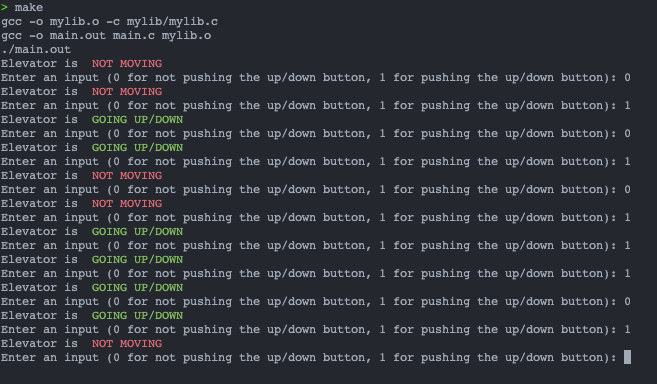

# Elevator System FSM by Evandra Harya Putra L1AC - 2602118433
## What is a 'Finite State Machine'?
a computing paradigm that can be used to represent and manage execution flow or to imitate sequential logic. This machine can only have one active state at any given moment.

#

## Components of Elevator System

### States
There are 4 states available to make this elevator system:

- State 1 - The elevator is in idle position, none of the buttons are pushed and stays in the first floor

- State 2 - up button are pushed, hence the elevator is going up

- State 3 - the elevator stays in the upstairs, none of the buttons are pushed

- State 4 - Elevator is going down, since the down button is pushed

To make things more comprehend, FSM is created.

### Transition Table

### Karnaugh Maps and Combinational Boolean Equations

#

## Running the System & Demonstration
### Visual Studio Code / any IDEs
Enter `make` in the built in terminal and type one of the inputs based on the given instructions (0 = up/down button is not pushed, 1 = up/down button is pushed).

### Results:
